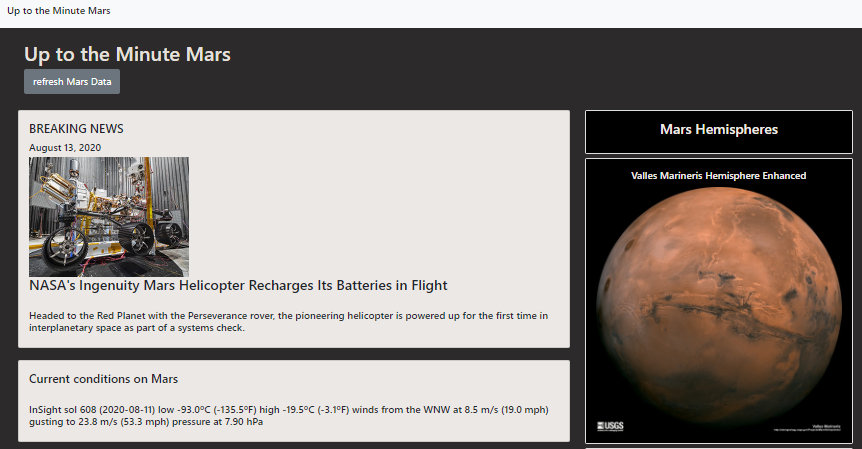
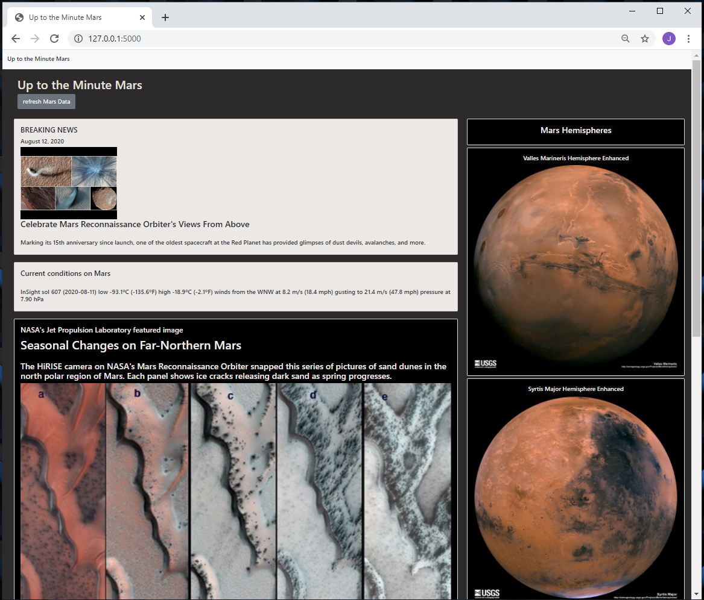
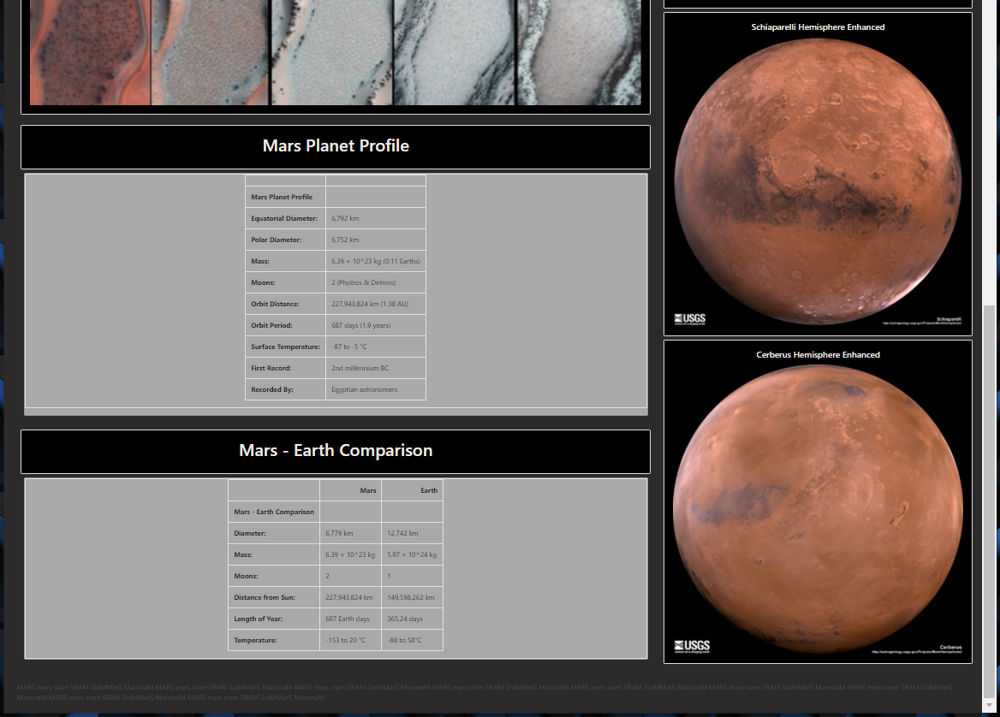

# web-scraping 
# MARS NEWS, WEATHER, and MORE
# BeautifulSoup and Splinter 

 - Web scraping using BeautifulSoup and Splinter
 - scraping function wrapped in a FLASK app.  
  - MongoDB used for data storage

# PART I - BeautifulSoup and Splinter
### Uses: Python, Pandas, Jupyter Notebook
    - import pandas, time, BeautifulSoup and splinter

### This section of the project is saved in the Jupyter Notebook file: **mission_to_mars.ipynb**

Jupyter Notebook used to develope the Python script to scrape various websites for the Mars data used in this project.  
The scrape includes:  

 - MARS NEWS  
    https://mars.nasa.gov/news/
 - MARS WEATHER  
    https://twitter.com/marswxreport?lang=en
 - NASA JPL FEATURED IMAGE  
    https://www.jpl.nasa.gov/spaceimages/?search=&category=Mars
 - MARS STATS  
    https://space-facts.com/mars/
 - MARS HEMISPHERE IMAGES  
 https://astrogeology.usgs.gov/search/results?q=hemisphere+enhanced&k1=target&v1=Mars
   

# PART II - Flask, HTML, and MongoDB
### Uses: Python, Pandas, Flask, and MongoDB
    - import pandas, flask, Pymongo, BeautifulSoup, splinter

### This section of the project is saved in the Python files: **scrape_mars.py** , **app.py** , **index.html**

The Mars scrape script that was developed in Jupyter Notebook was dropped into the python file scrape_mars.py   

## FLASK APP
The Mars scrape script (**scrape_mars.py**) was then imported into the **app.py** file and wrapped in Flask

### The Flask app does several things:

  - Scrapes the five websites for the relevent Mars data
  - Connects to a MongoDB to store the data 

## INDEX.html
###  The html file brings all of the pieces together
 - The **refresh Mars Data** button launches the scrape function, driven by Splinter and BeautifulSoup, and returns the scraped data to a MongoDB database.
 - The stored data is then called by and displayed by the index.html file

